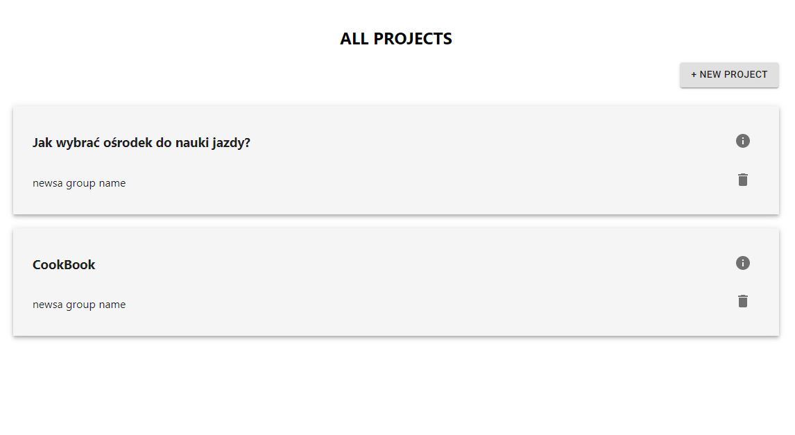
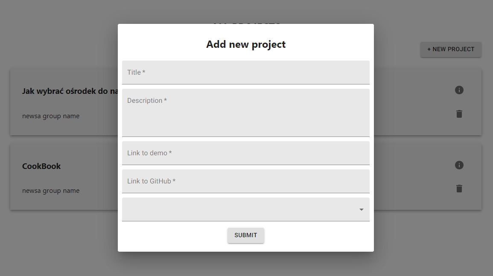
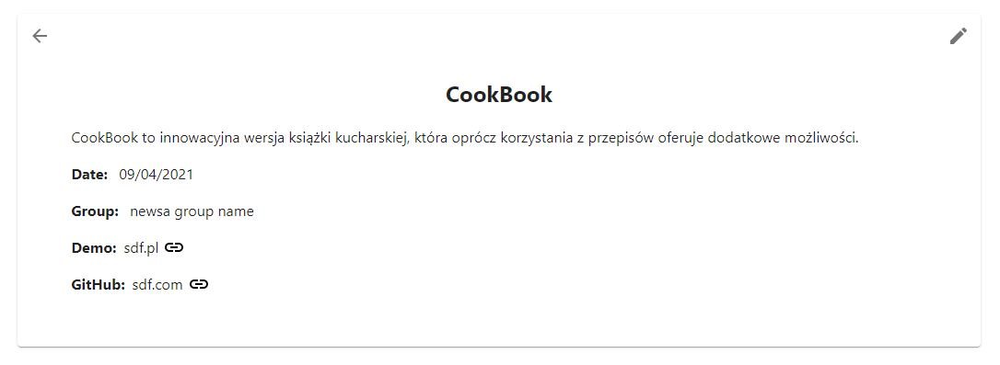
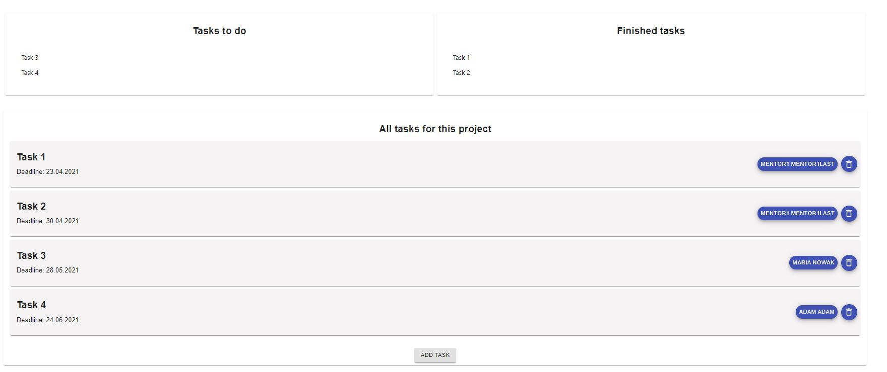
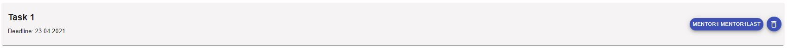
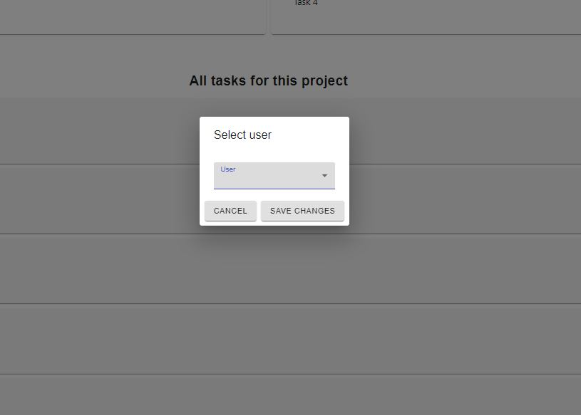
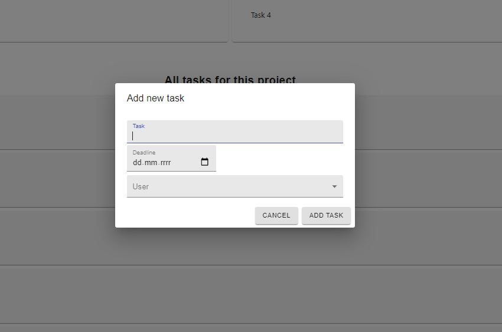
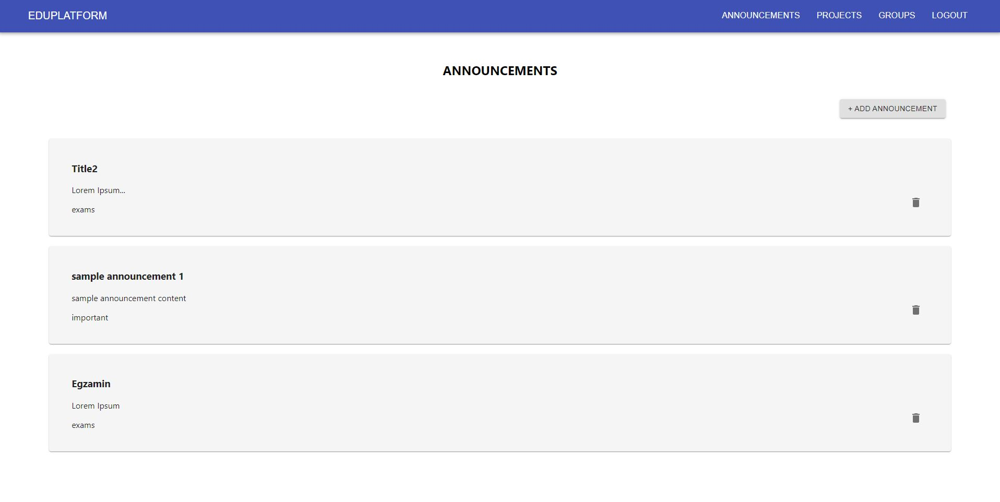
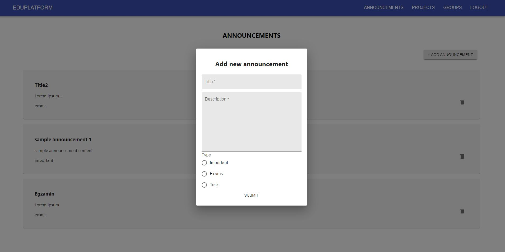

# EduPlatform

## Scripts

To run app in the development mode:

```
npm start
```

To run tests:

```
npm test
```

To deploy on Github Pages:

```
npm run deploy
```

## Menu
Menu is created basing on Material UI library. Navigation links depends on user login status. If user isn't authenticated then there isn't anything on navbar.


## Projects

Projects are displayed in a form of list. There are two buttons for each project. First redirects to subpage with detailed information. Second deletes project. On the top of the page button to add new project is placed.



Project form is displayed when adding new project or updating existing one. When adding, form is empty. When updating, form is filled with current data.



Project card contains detailed informations about project. There are two buttons. First redirects to the list of projects. Second opens form to update project.



## Tasks 
Tasks are connected with project. There is section with tasks status, where it is possible to change task status by click on it. Also there is section with tasks, where we see all task for current project.



Every task has two buttons: 
- add responsible person (after click there will be form for select person);
- remove task.





There is also possibility to add task by click on button below. 



## Announcements

Announcements are displayed in a form of list. Every announcement card contains information such title,content and type, for example: Important. Every card also contains delete button. Delete button  remove announcement from base. On the top of the page there is button witch  allows to add new announcement. 



When filling in the form, there need to be provided the title and content.  Also one of the three types need to be choose. Announcemnt is added by submit button. Click outside of its area of form cancel the operation.




